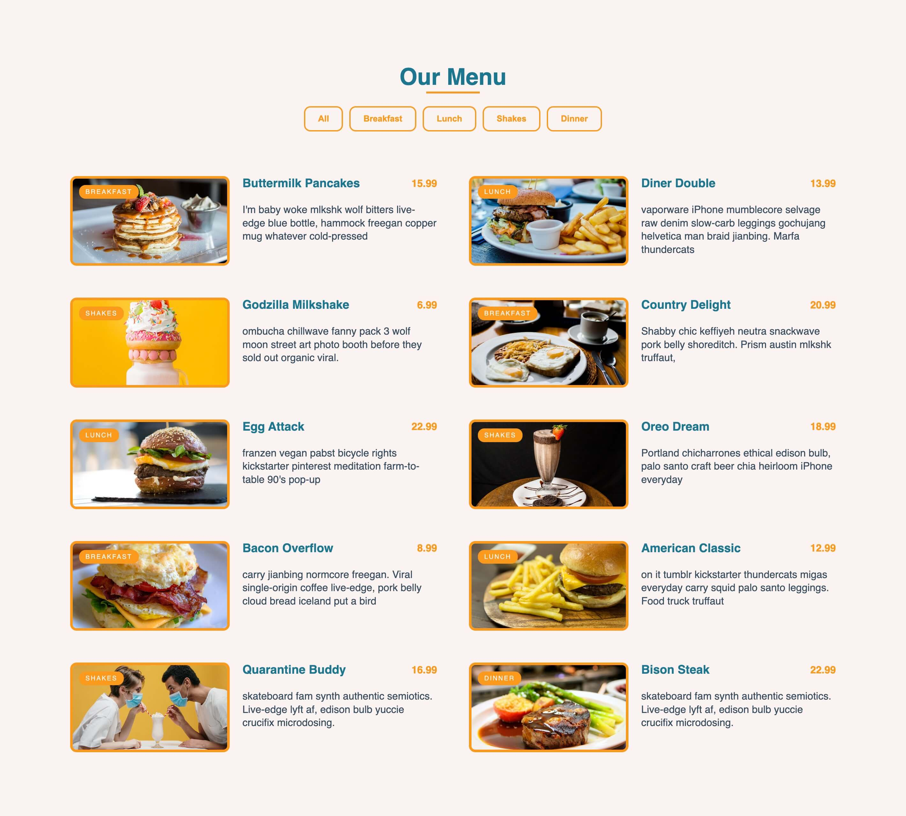

# Image gallery

> A page that displays different menus.



## Table of contents

- [General info](#general-info)
- [Technologies](#technologies)
- [Setup](#setup)
- [Features](#features)
- [Status](#status)

## General info

> The objective of the project is to practice separation of concern in
> JavaScript.


## Technologies

- JavaScript
- HTML5
- CSS3
- VSC code

## Setup

1. clone the repo and 
2. initialize it by installing all dependancies using `npm i`.
3. Visit the index.html file (use live server if possible)

## Code Examples

```js
const filterHandler = (id) => {
    const menuItems = document.querySelectorAll('.menu-item');
    menuItems.forEach((item) => {
        if(id === 'all') {
            item.classList.remove('hide');
        } else if (item.classList.contains(id)) {
            item.classList.remove('hide');
        } else {
            item.classList.add('hide');
        }
    })
}

export default filterHandler;
```

## Features

List of features ready and Todos for future development
-Ready feature
- View transition for animating the articles

-Animate the menu items
- Enable dark mode

## Status

Project is: _completed_
